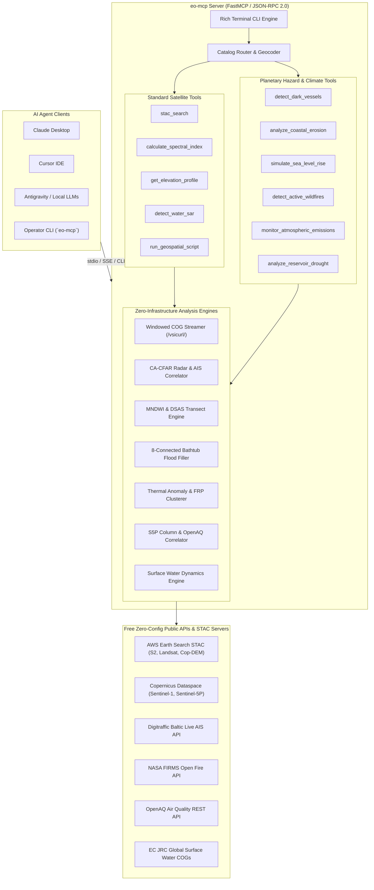

<div align="center">

# `eo-mcp`

### The Open Source Model Context Protocol (MCP) for Planetary Earth Observation

[](https://opensource.org/licenses/Apache-2.0)
[](https://www.python.org/downloads/)
[](https://modelcontextprotocol.io)
[](https://stacspec.org)
[](#free-government-catalogs)

**Empower AI agents to autonomously discover, stream, and compute satellite analytics from free government archives.**  
Plugs directly into **Claude Desktop**, **Cursor**, **Codex**, **Antigravity**, and autonomous Python agent loops with zero vendor lock-in and zero proprietary API costs.

[Website & Live Interactive Demo](https://eo-mcp.github.io/) • [Quickstart](#quickstart) • [Tools Reference](#tools-reference) • [Architecture](#architecture)

<p align="center">
  
</p>

</div>

---

## Why `eo-mcp`?

Proprietary platforms (like Planet Labs' agentic dashboard or Google Earth Engine) build walled gardens that trap users in closed user interfaces and expensive recurring subscription paywalls. 

`eo-mcp` takes the opposite philosophy, modeled after open-source community standards:
- **100% Open Standards**: Speaks standard **Model Context Protocol (JSON-RPC 2.0)**. Works in Claude Desktop, Cursor IDE, VS Code, Open WebUI, and custom agent frameworks (LangChain, AutoGen, CrewAI).
- **Zero-Config Free Government Data**: Instant out-of-the-box queries to AWS Earth Search, NASA CMR, and Copernicus public STAC endpoints for Sentinel-2, Landsat 8/9, and Copernicus DEM without needing API keys.
- **Cloud-Native COG Streaming**: Never download a 1GB satellite granule again. `eo-mcp` leverages HTTP range requests (`/vsicurl/`) to stream and compute band math on only the exact bounding box of your city, farm, or river in seconds (saving >98% bandwidth).
- **Autonomous Agentic Script Runner**: When standard tools aren't enough, agents can generate and run custom `rasterio`, `xarray`, and `geopandas` scripts inside an isolated geospatial sandbox.

---

## Quickstart

> [!IMPORTANT]
> **100% Free & Zero-Config:** You **DO NOT** need a Copernicus API key, ESA account, or paid subscription. Baseline satellite streams (Sentinel-2, Landsat, and Copernicus DEM) stream directly from open government cloud archives out-of-the-box.

### 0. Prerequisite: Install `uv`
`eo-mcp` is powered by Astral's `uv` for instant isolated execution:
- **macOS / Linux**:
  ```bash
  curl -LsSf https://astral.sh/uv/install.sh | sh
  ```
- **Windows (PowerShell)**:
  ```powershell
  powershell -ExecutionPolicy ByPass -c "irm https://astral.sh/uv/install.ps1 | iex"
  ```

---

### 1. Instant Run with `uvx` (Recommended)

Run directly from GitHub with zero installation or virtualenv setup:

```bash
uvx --from git+https://github.com/eo-mcp/eo-mcp eo-mcp
```

Or run diagnostics to verify your environment and open STAC feeds:

```bash
uvx --from git+https://github.com/eo-mcp/eo-mcp eo-mcp doctor
```

Or install locally from source:

```bash
git clone https://github.com/eo-mcp/eo-mcp.git
cd eo-mcp
uv run eo-mcp
```

---

### 2. Configure Your AI Agent

#### Claude Desktop
Add this to your `claude_desktop_config.json`:
- **macOS**: `~/Library/Application Support/Claude/claude_desktop_config.json`
- **Windows**: `%APPDATA%\Claude\claude_desktop_config.json`

```json
{
  "mcpServers": {
    "eo-mcp": {
      "command": "uvx",
      "args": ["--from", "git+https://github.com/eo-mcp/eo-mcp", "eo-mcp"]
    }
  }
}
```

#### Cursor IDE
1. Open **Cursor Settings** (`Ctrl+Shift+J` or `Cmd+Shift+J`).
2. Navigate to **Features** > **MCP**.
3. Click **+ Add New MCP Server**:
   - **Name**: `eo-mcp`
   - **Type**: `command`
   - **Command**: `uvx --from git+https://github.com/eo-mcp/eo-mcp eo-mcp`

#### Codex
Register `eo-mcp` into your Codex environment with a single command:

```bash
codex mcp add eo-mcp -- uvx --from git+https://github.com/eo-mcp/eo-mcp eo-mcp
```

#### Google Antigravity
Add to your workspace or global `.antigravity/mcp.json`:

```json
{
  "mcpServers": {
    "eo-mcp": {
      "command": "uvx",
      "args": ["--from", "git+https://github.com/eo-mcp/eo-mcp", "eo-mcp"]
    }
  }
}
```

---

### ❓ Troubleshooting: Why is my AI asking for a Copernicus API key?

> [!WARNING]
> If Claude, Cursor, or ChatGPT asks you: *"Please provide your Copernicus API key or credentials"*, **that means `eo-mcp` is not yet running in your client!**
>
> When an MCP server has not been configured or failed to start, LLMs fall back to generic training data and mistakenly assume you need a paid or registered API key.
> 
> **How to fix in 30 seconds:**
> 1. Ensure `uv` is installed and accessible in your terminal (`uv --version`).
> 2. In **Cursor**, make sure `eo-mcp` displays a **green status indicator** under **Settings > Features > MCP**.
> 3. In **Claude Desktop**, look for the **hammer icon (🔨)** in the chat window to confirm `eo-mcp` tools are active.
> 4. Test connectivity in your terminal with `uvx --from git+https://github.com/eo-mcp/eo-mcp eo-mcp doctor`.


---

## Supported Satellite Collections

| Mission / Sensor | Resolution | Spectral Domain | Primary Applications | Free STAC Source |
| :--- | :--- | :--- | :--- | :--- |
| **Sentinel-2 L2A** | 10m - 20m | Optical (12 Bands: VNIR/SWIR) | Vegetation Health (NDVI), Water Bodies (NDWI), Crops | AWS Earth Search / CDSE |
| **Landsat 8 & 9 (C2 L2)** | 30m | Optical & Thermal (OLI-2/TIRS-2) | Burn Severity (NBR), Land Surface Temp (LST) | AWS Earth Search / USGS |
| **Copernicus DEM GLO-30** | 30m | Elevation (DSM) | Elevation Profiles, Slope, Aspect, Flood Basins | AWS Earth Search / CDSE |
| **Sentinel-1 GRD** | 10m | C-Band SAR (VV/VH Radar) | All-Weather Flood Inundation & Soil Moisture | CDSE / Planetary Computer |
| **Sentinel-5P TROPOMI** | 5.5km × 3.5km | Atmospheric Absorption | NO₂, SO₂, Carbon Monoxide, Methane, Aerosols | CDSE / Planetary Computer |
| **MODIS / VIIRS** | 250m - 1km | Optical, Thermal & Fire | Active Wildfires, Global Daily Phenology | NASA CMR STAC |

---

## Tools Reference

`eo-mcp` exposes high-level turnkey tools designed specifically for LLM reasoning and agent tool use:

### 1. `eo_geocode(query: str) -> dict`
Translates natural language place names (e.g. `"Valencia, Spain"`, `"Imperial Valley, CA"`, `"Lake Chad"`) into standard WGS84 bounding boxes `[min_lon, min_lat, max_lon, max_lat]`.

### 2. `stac_search(bbox: list, datetime_range: str, collections: list, max_cloud_cover: float = 20.0) -> list`
Searches free STAC catalogs for available satellite scenes matching the spatial area, cloud thresholds, and date window. Returns scene IDs, acquisition dates, cloud percentages, and direct asset URLs.

### 3. `calculate_spectral_index(collection: str, index: str, bbox: list, date: str) -> dict`
Streams the required bands over HTTP range requests and computes the requested index:
- **NDVI**: `(B08 - B04) / (B08 + B04)` (Vegetation vigor & biomass)
- **NDWI**: `(B03 - B08) / (B03 + B08)` (Water body delineation & surface wetness)
- **NBR**: `(B08 - B12) / (B08 + B12)` (Wildfire burn severity & scar mapping)
- **EVI**: Enhanced Vegetation Index (Atmospherically corrected canopy structure)
Returns summary statistics (mean, min, max, std), histogram, and optional GeoTIFF/PNG export path.

### 4. `get_elevation_profile(bbox: list, calculate_slope: bool = True) -> dict`
Queries the gold-standard Copernicus DEM GLO-30 (30m) dataset. Extracts minimum/maximum/mean elevation, terrain slope gradients, and aspect orientation without downloading the global raster.

### 5. `detect_water_sar(bbox: list, date: str, threshold_db: float = -16.0) -> dict`
Extracts Sentinel-1 C-Band SAR radar backscatter (sigma0 in dB). Radar signals scatter away from calm surface water, producing distinct dark backscatter signatures unaffected by optical cloud cover.

### 6. `run_geospatial_script(script_code: str) -> dict`
Allows autonomous coding agents to write and execute arbitrary Python geospatial workflows in an isolated sandbox pre-loaded with `rasterio`, `numpy`, `shapely`, and `scipy`.

### 7. `detect_dark_vessels(bbox: list, datetime_range: str, ais_source: str = "open_baltic_api", pfa_factor: float = 3.2, format: str = "summary") -> str`
Detects radar-reflective metallic ship hulls in Sentinel-1 SAR imagery using CA-CFAR adaptive thresholding and correlates them with existing open public AIS APIs (Digitraffic Baltic Sea open API or user-supplied AIS feeds) to flag unreported **Dark Vessels** (`DARK_VESSEL`), verified ships (`TRUSTED`), and spoofed signals (`SPOOF_OR_ABSENT`), alongside bilge/oil slick discharge alerts (MSFD Descriptor 8).  
**Outputs:** JSON summary, GIS-ready GeoJSON FeatureCollection (`format="geojson"`), or tabular CSV (`format="csv"`).

### 8. `analyze_coastal_erosion(bbox: list, historical_date_range: str, recent_date_range: str, transect_sample_step: int = 5, format: str = "summary") -> str`
Quantifies multi-temporal coastal shoreline retreat and erosion rates ($\text{m/year}$) between two satellite observation dates using automated MNDWI water indexing on Sentinel-2 / Landsat scenes and perpendicular baseline transects (USGS DSAS methodology). Classifies coastal segments into critical erosion, stable, and accretion zones aligned with the EU Climate Adaptation Strategy.  
**Outputs:** JSON summary, GIS-ready GeoJSON FeatureCollection (`format="geojson"`), or tabular CSV (`format="csv"`).

### 9. `simulate_sea_level_rise(bbox: list, water_level_rise_m: float = 1.0, storm_surge_m: float = 0.0, scenario: str = None, format: str = "summary") -> str`
Simulates coastal inundation and storm surge flood risk using Copernicus DEM GLO-30 (30m) elevation and an 8-connected morphological flood-fill algorithm (hydro-connected bathtub model) preventing inland depression artifacts. Supports IPCC AR6 climate projections (`SSP1-2.6`, `SSP2-4.5`, `SSP5-8.5`) and EU Floods Directive hazard zoning.  
**Outputs:** JSON summary with ASCII flood distribution map, GIS-ready GeoJSON FeatureCollection (`format="geojson"`), or tabular CSV (`format="csv"`).

### 10. `detect_active_wildfires(bbox: list, days: int = 2, source: str = "VIIRS_NOAA20_NRT", format: str = "summary") -> str`
Queries open NASA FIRMS active fire feeds (VIIRS / MODIS) to monitor thermal anomalies, calculate Fire Radiative Power (FRP in MW), and cluster contiguous fire perimeters with EFFIS / Copernicus Emergency Management fire danger classifications (`EXTREME`, `HIGH`, `MODERATE`).  
**Outputs:** JSON summary, GIS-ready GeoJSON FeatureCollection (`format="geojson"`), or tabular CSV (`format="csv"`).

### 11. `monitor_atmospheric_emissions(bbox: list, gas: str = "NO2", datetime_range: str = "2024-06-01/2024-06-30", format: str = "summary") -> str`
Monitors tropospheric trace gases ($\text{NO}_2$, $\text{CH}_4$ Methane, $\text{SO}_2$, $\text{CO}$) from Sentinel-5P TROPOMI column densities and cross-references them against in-situ ground monitoring stations from the open OpenAQ public REST API for EU Ambient Air Quality Directive compliance.  
**Outputs:** JSON summary, GIS-ready GeoJSON FeatureCollection (`format="geojson"`), or tabular CSV (`format="csv"`).

### 12. `analyze_reservoir_drought(bbox: list, historical_year: int = 2019, recent_year: int = 2024, format: str = "summary") -> str`
Analyzes reservoir shrinkage and freshwater deficit using the EC Joint Research Centre (JRC) Global Surface Water archive and multi-temporal Sentinel-2 imagery. Quantifies surface water depletion ($\text{ha}$, $\text{km}^2$), transition breakdown (permanent water vs. desiccated dry margin), and drought severity classes for the EU Water Framework Directive.  
**Outputs:** JSON summary, GIS-ready GeoJSON FeatureCollection (`format="geojson"`), or tabular CSV (`format="csv"`).

### 13. `calculate_burn_severity(bbox: list, pre_fire_date_range: str, post_fire_date_range: str, format: str = "summary") -> str`
Quantifies post-fire damage using difference Normalized Burn Ratio ($dNBR$) and Relativized Burn Ratio ($RBR$) computed from pre- and post-fire Sentinel-2 L2A scenes (NIR Band 8 and SWIR22 Band 12). Maps spatial burn perimeters classified into USGS and European Forest Fire Information System (EFFIS) severity grades (`HIGH_SEVERITY`, `MODERATE_HIGH`, `MODERATE_LOW`, `LOW_SEVERITY`, `UNBURNED`).  
**Outputs:** JSON summary, GIS-ready GeoJSON FeatureCollection (`format="geojson"`), or tabular CSV (`format="csv"`).

### 14. `analyze_urban_heat_island(bbox: list, datetime_range: str, format: str = "summary") -> str`
Calculates Land Surface Temperature ($LST$ in °C) and Urban Heat Island ($UHI$) intensity gradients using Landsat-8/9 Thermal Infrared Sensor (TIRS Band 10: $10.895\ \mu\text{m}$) combined with NDVI Fractional Vegetation Cover (FVC) and Sobrino surface emissivity modeling. Detects extreme heat risk anomalies, thermal hotspots, and cool-island vegetative buffers.  
**Outputs:** JSON summary with ASCII temperature distribution map, GIS-ready GeoJSON FeatureCollection (`format="geojson"`), or tabular CSV (`format="csv"`).

### 15. `monitor_crop_phenology(bbox: list, year: int = 2024, crop_type: str = None, format: str = "summary") -> str`
Tracks multi-temporal agricultural canopy growth trajectories across the seasonal cycle using cloud-free Sentinel-2 observations. Extracts key phenological inflection milestones: Start of Season (SOS / greenup), Peak of Season (POS / maximum photosynthetic capacity), and End of Season (EOS / senescence). Compares seasonal canopy amplitude and vigor anomaly percentages against regional crop baselines.  
**Outputs:** JSON summary, GIS-ready GeoJSON FeatureCollection (`format="geojson"`), or tabular CSV (`format="csv"`).

### 16. `configure_credentials(provider: str, username: str = None, password: str = None, token: str = None) -> dict`
Dynamically configures or updates credentials for external satellite and data providers in-session (`cdse`, `earthdata`, `planetary_computer`, `nasa_firms`). Allows users and agents to unlock advanced authenticated features (such as direct granule downloads) on demand without restarting the server.

### 17. `get_credential_status() -> dict`
Inspects configured authentication status across all supported satellite catalog providers. Verifies whether zero-config public mode is active and safely displays masked status indicators.

### 18. `download_copernicus_granule(product_id: str, output_dir: str = None, username: str = None, password: str = None) -> dict`
Generates authenticated download manifests, OData API links, and curl commands for official Copernicus Data Space Ecosystem (CDSE) full-granule archive products (Sentinel-1, Sentinel-2, Sentinel-3, Sentinel-5P).

---

## Rich Interactive CLI Tools

`eo-mcp` is also a full-featured operator CLI with Rich terminal tables, status badges, and GIS piping:

```bash
# Maritime surveillance & dark vessel tracking
eo-mcp dark-vessels --bbox 24.5 59.8 25.2 60.2 --format summary
eo-mcp dark-vessels --bbox 24.5 59.8 25.2 60.2 --format geojson > dark_vessels.geojson

# Shoreline erosion transects (m/year)
eo-mcp coastal-erosion --bbox -2.85 56.32 -2.75 56.38 --hist-date 2019-05-01/2019-08-31 --recent-date 2024-05-01/2024-08-31

# IPCC Sea Level Rise & Storm Surge Simulation with ASCII depth map
eo-mcp sea-level-rise --bbox 22.8 38.6 23.2 38.9 --scenario SSP5-8.5 --surge 0.5

# Active wildfires & FRP thermal perimeter clustering
eo-mcp wildfires --bbox -120.5 38.5 -120.0 39.0 --days 2

# Post-fire burn severity assessment (dNBR & EFFIS classification)
eo-mcp burn-severity --bbox -120.5 38.5 -120.0 39.0 --pre-date 2024-05-01 --post-date 2024-07-01

# Land Surface Temperature & Urban Heat Island analysis (LST in °C)
eo-mcp urban-heat --bbox 2.2 48.7 2.5 49.0 --date 2024-07-15

# Agricultural crop phenology & seasonal growth milestones (SOS/POS/EOS)
eo-mcp crop-phenology --bbox -119.5 36.2 -119.4 36.3 --year 2024 --crop Almonds

# Atmospheric gas emissions & OpenAQ ground stations
eo-mcp emissions --bbox 2.2 48.7 2.5 49.0 --gas NO2

# Reservoir drought depletion & water loss dynamics
eo-mcp drought --bbox -4.5 37.5 -4.0 38.0 --hist-year 2019 --recent-year 2024

# Inspect or configure provider credentials
eo-mcp auth
eo-mcp auth set --provider cdse --username user@example.com --password secret
```

---

## Architecture



---

## Cloud-Native COG Streaming (How it works)

Traditional GIS downloads entire satellite scenes (often 800MB to 1.5GB) before clipping to the study area. When interacting with an AI agent over the internet, downloading gigabytes of data per query creates latency and exhausts disk space.

`eo-mcp` uses **Cloud Optimized GeoTIFF (COG)** range streaming:
1. The server reads the COG header over HTTP (~10KB) to discover internal tile offsets and coordinate projection.
2. It translates the user's bounding box into pixel window coordinates.
3. It performs targeted HTTP `Range: bytes=...` requests to pull **only the pixels covering the bounding box**.
4. A typical query transfers **2 MB to 5 MB** of data and completes in under 2 seconds.

---

## Flexible Credential Management

`eo-mcp` is designed with a **zero-friction, open-first philosophy**:
1. **Zero-Config Default (100% Free)**: Out of the box, `eo-mcp` streams satellite data from free open government cloud archives (AWS Earth Search, NASA CMR, Copernicus public STAC). No user registration, API keys, or credit cards are needed.
2. **First-Class Support for User Credentials**: When users or enterprise agents need to access authenticated or proprietary features (such as direct Copernicus CDSE full-granule downloads, NASA Earthdata restricted collections, or Microsoft Planetary Computer signed tokens), credentials can be provided at any time:
   - **Environment Variables (`.env`)**:
     ```bash
     export CDSE_USERNAME="your-cdse-email"
     export CDSE_PASSWORD="your-cdse-password"
     export EARTHDATA_TOKEN="your-nasa-token"
     export PC_SDK_SUBSCRIPTION_KEY="your-pc-key"
     export FIRMS_MAP_KEY="your-firms-key"
     ```
   - **In-Session Dynamic Tool (`configure_credentials`)**:
     AI agents can invoke `configure_credentials(provider="cdse", username="...", password="...")` dynamically during the conversation without restarting the server.
   - **CLI Credential Command**:
     ```bash
     eo-mcp auth set --provider cdse --username "user@example.com" --password "secret"
     eo-mcp auth
     ```

---

## Contributing

`eo-mcp` is an open-source project by [sounny.com](https://sounny.com) to establish an open standard for agentic Earth Observation.

Contributions are warmly welcome!

---

## License & Legal

Licensed under the **Apache License, Version 2.0**. See [LICENSE](LICENSE) for details.
- [Contact Maintainer](https://eo-mcp.github.io/contact.html)
- [Privacy Policy](https://eo-mcp.github.io/privacy.html)
- [Terms of Use](https://eo-mcp.github.io/terms.html)
