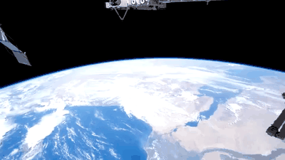
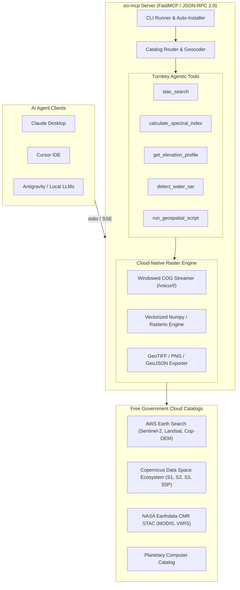

<div align="center">

# `eo-mcp`

### The Open Source Model Context Protocol (MCP) for Planetary Earth Observation

[](https://opensource.org/licenses/Apache-2.0)
[](https://www.python.org/downloads/)
[](https://modelcontextprotocol.io)
[](https://stacspec.org)
[](#free-government-catalogs)

**Empower AI agents to autonomously discover, stream, and compute satellite analytics from free government archives.**  
Plugs directly into **Claude Desktop**, **Cursor**, **Codex**, **Antigravity**, and autonomous Python agent loops with zero vendor lock-in and zero proprietary API costs.

[Website & Live Interactive Demo](https://eo-mcp.github.io/) • [Quickstart](#quickstart) • [Tools Reference](#tools-reference) • [Architecture](#architecture)

<p align="center">
  
</p>

</div>

---

## Why `eo-mcp`?

Proprietary platforms (like Planet Labs' agentic dashboard or Google Earth Engine) build walled gardens that trap users in closed user interfaces and expensive recurring subscription paywalls. 

`eo-mcp` takes the opposite philosophy, modeled after open-source community standards:
- **100% Open Standards**: Speaks standard **Model Context Protocol (JSON-RPC 2.0)**. Works in Claude Desktop, Cursor IDE, VS Code, Open WebUI, and custom agent frameworks (LangChain, AutoGen, CrewAI).
- **Zero-Config Free Government Data**: Instant out-of-the-box queries to AWS Earth Search, NASA CMR, and Copernicus public STAC endpoints for Sentinel-2, Landsat 8/9, and Copernicus DEM without needing API keys.
- **Cloud-Native COG Streaming**: Never download a 1GB satellite granule again. `eo-mcp` leverages HTTP range requests (`/vsicurl/`) to stream and compute band math on only the exact bounding box of your city, farm, or river in seconds (saving >98% bandwidth).
- **Autonomous Agentic Script Runner**: When standard tools aren't enough, agents can generate and run custom `rasterio`, `xarray`, and `geopandas` scripts inside an isolated geospatial sandbox.

---

## Quickstart

### 1. Instant Run with `uvx` (Recommended)

Run directly from GitHub with zero installation or virtualenv setup:

```bash
uvx --from git+https://github.com/eo-mcp/eo-mcp eo-mcp
```

Or install locally from source:

```bash
git clone https://github.com/eo-mcp/eo-mcp.git
cd eo-mcp
uv run eo-mcp
```

---

### 2. Configure Your AI Agent

#### Claude Desktop
Add this to your `claude_desktop_config.json`:
- **macOS**: `~/Library/Application Support/Claude/claude_desktop_config.json`
- **Windows**: `%APPDATA%\Claude\claude_desktop_config.json`

```json
{
  "mcpServers": {
    "eo-mcp": {
      "command": "uvx",
      "args": ["--from", "git+https://github.com/eo-mcp/eo-mcp", "eo-mcp"]
    }
  }
}
```

#### Cursor IDE
1. Open **Cursor Settings** (`Ctrl+Shift+J` or `Cmd+Shift+J`).
2. Navigate to **Features** > **MCP**.
3. Click **+ Add New MCP Server**:
   - **Name**: `eo-mcp`
   - **Type**: `command`
   - **Command**: `uvx --from git+https://github.com/eo-mcp/eo-mcp eo-mcp`

#### Codex
Register `eo-mcp` into your Codex environment with a single command:

```bash
codex mcp add eo-mcp -- uvx --from git+https://github.com/eo-mcp/eo-mcp eo-mcp
```

#### Google Antigravity
Add to your workspace or global `.antigravity/mcp.json`:

```json
{
  "mcpServers": {
    "eo-mcp": {
      "command": "uvx",
      "args": ["--from", "git+https://github.com/eo-mcp/eo-mcp", "eo-mcp"]
    }
  }
}
```

---

## Supported Satellite Collections

| Mission / Sensor | Resolution | Spectral Domain | Primary Applications | Free STAC Source |
| :--- | :--- | :--- | :--- | :--- |
| **Sentinel-2 L2A** | 10m - 20m | Optical (12 Bands: VNIR/SWIR) | Vegetation Health (NDVI), Water Bodies (NDWI), Crops | AWS Earth Search / CDSE |
| **Landsat 8 & 9 (C2 L2)** | 30m | Optical & Thermal (OLI-2/TIRS-2) | Burn Severity (NBR), Land Surface Temp (LST) | AWS Earth Search / USGS |
| **Copernicus DEM GLO-30** | 30m | Elevation (DSM) | Elevation Profiles, Slope, Aspect, Flood Basins | AWS Earth Search / CDSE |
| **Sentinel-1 GRD** | 10m | C-Band SAR (VV/VH Radar) | All-Weather Flood Inundation & Soil Moisture | CDSE / Planetary Computer |
| **Sentinel-5P TROPOMI** | 5.5km × 3.5km | Atmospheric Absorption | NO₂, SO₂, Carbon Monoxide, Methane, Aerosols | CDSE / Planetary Computer |
| **MODIS / VIIRS** | 250m - 1km | Optical, Thermal & Fire | Active Wildfires, Global Daily Phenology | NASA CMR STAC |

---

## Tools Reference

`eo-mcp` exposes high-level turnkey tools designed specifically for LLM reasoning and agent tool use:

### 1. `eo_geocode(query: str) -> dict`
Translates natural language place names (e.g. `"Valencia, Spain"`, `"Imperial Valley, CA"`, `"Lake Chad"`) into standard WGS84 bounding boxes `[min_lon, min_lat, max_lon, max_lat]`.

### 2. `stac_search(bbox: list, datetime_range: str, collections: list, max_cloud_cover: float = 20.0) -> list`
Searches free STAC catalogs for available satellite scenes matching the spatial area, cloud thresholds, and date window. Returns scene IDs, acquisition dates, cloud percentages, and direct asset URLs.

### 3. `calculate_spectral_index(collection: str, index: str, bbox: list, date: str) -> dict`
Streams the required bands over HTTP range requests and computes the requested index:
- **NDVI**: `(B08 - B04) / (B08 + B04)` (Vegetation vigor & biomass)
- **NDWI**: `(B03 - B08) / (B03 + B08)` (Water body delineation & surface wetness)
- **NBR**: `(B08 - B12) / (B08 + B12)` (Wildfire burn severity & scar mapping)
- **EVI**: Enhanced Vegetation Index (Atmospherically corrected canopy structure)
Returns summary statistics (mean, min, max, std), histogram, and optional GeoTIFF/PNG export path.

### 4. `get_elevation_profile(bbox: list, calculate_slope: bool = True) -> dict`
Queries the gold-standard Copernicus DEM GLO-30 (30m) dataset. Extracts minimum/maximum/mean elevation, terrain slope gradients, and aspect orientation without downloading the global raster.

### 5. `detect_water_sar(bbox: list, date: str, threshold_db: float = -16.0) -> dict`
Extracts Sentinel-1 C-Band SAR radar backscatter (sigma0 in dB). Radar signals scatter away from calm surface water, producing distinct dark backscatter signatures unaffected by optical cloud cover.

### 6. `run_geospatial_script(script: str) -> dict`
Allows autonomous coding agents to write and execute arbitrary Python geospatial workflows in a sandbox pre-loaded with `rasterio`, `numpy`, `shapely`, `xarray`, and `pystac`.

---

## Architecture



---

## Cloud-Native COG Streaming (How it works)

Traditional GIS downloads entire satellite scenes (often 800MB to 1.5GB) before clipping to the study area. When interacting with an AI agent over the internet, downloading gigabytes of data per query creates latency and exhausts disk space.

`eo-mcp` uses **Cloud Optimized GeoTIFF (COG)** range streaming:
1. The server reads the COG header over HTTP (~10KB) to discover internal tile offsets and coordinate projection.
2. It translates the user's bounding box into pixel window coordinates.
3. It performs targeted HTTP `Range: bytes=...` requests to pull **only the pixels covering the bounding box**.
4. A typical query transfers **2 MB to 5 MB** of data and completes in under 2 seconds.

---

## Optional Authentication

No API keys are required for standard operation. However, if you require full-granule downloads from the official Copernicus Data Space Ecosystem (CDSE) or NASA Earthdata, provide them in your environment:

```bash
export CDSE_USERNAME="your-cdse-email"
export CDSE_PASSWORD="your-cdse-password"
export EARTHDATA_TOKEN="your-nasa-token"
```

---

## Contributing

`eo-mcp` is an open-source project by [sounny.com](https://sounny.com) to establish an open standard for agentic Earth Observation.

Contributions are warmly welcome!

---

## License & Legal

Licensed under the **Apache License, Version 2.0**. See [LICENSE](LICENSE) for details.
- [Privacy Policy](https://eo-mcp.github.io/privacy.html)
- [Terms of Use](https://eo-mcp.github.io/terms.html)
